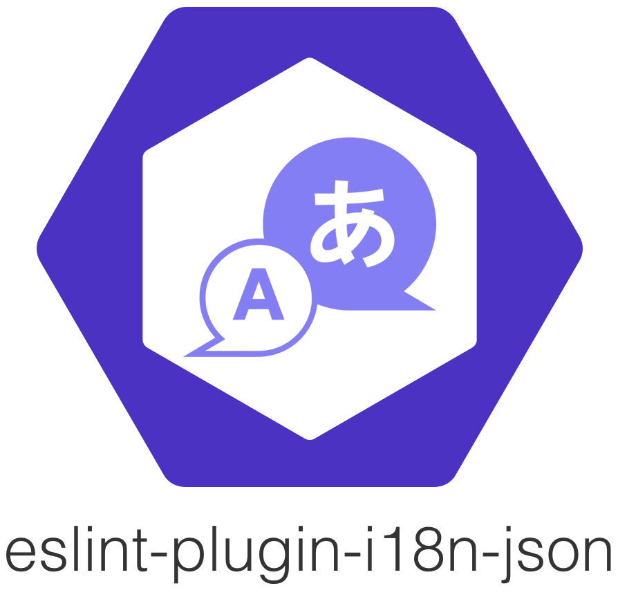
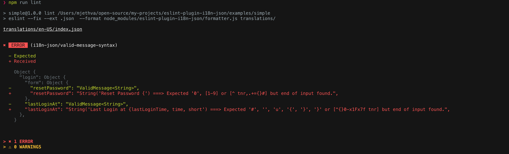
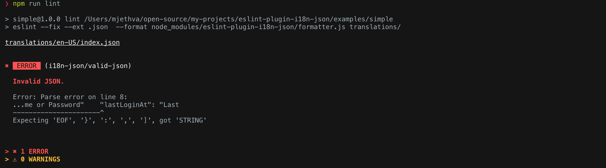
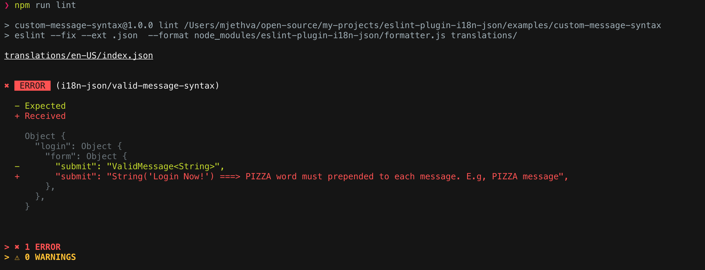
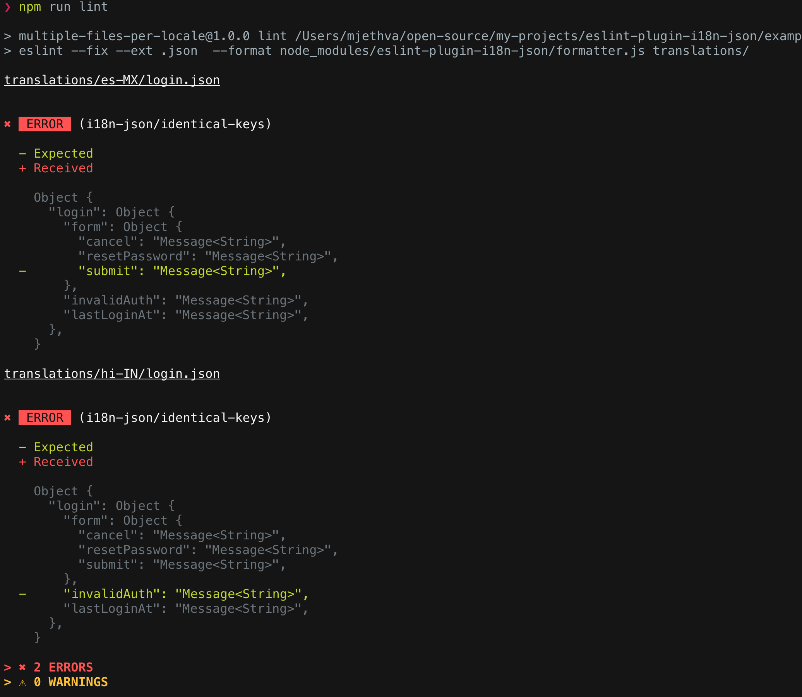

# eslint-plugin-i18n-json

[](https://www.npmjs.com/package/eslint-plugin-i18n-json)

> Fully extendable eslint plugin for JSON i18n translation files.

<p align="center">
  
</p>

## Table of Contents

- [Features](#features)
- [Getting Started](#getting-started)
- [Examples](#examples)
- [Rules](#example)
  - [i18n-json/valid-json](#i18n-jsonvalid-json)
  - [i18n-json/valid-message-syntax](#i18n-jsonvalid-message-syntax)
  - [i18n-json/identical-keys](#i18n-jsonidentical-keys)
- [Special Thanks](#special-thanks)
- [License](#license)


## Features 🚀

- lint JSON translation files
  - rule: `i18n-json/valid-json`
  - configure a custom linter in case the default doesn't fit your needs.

- validate syntax per message
  - rule: `i18n-json/valid-message-syntax`
  - default syntax check is for ICU Message Syntax
  - can support any message syntax through custom validators. [Example](examples/custom-message-syntax/)

- ensure translation files have identical keys
  - `i18n-json/identical-keys`
  - supports different custom mappings and on the fly key structure generation

- sort translation keys in ascending order through eslint auto-fix
- supports **any level of nesting** in the translation file. (escapes `.` in key names)

**Note: Check out the [Examples](examples/) folder to see different use cases and project setups.**

### Requires

- eslint >= 4.0.0
- node >= 6.0.0


## Getting Started

Right out of the box you get the following through our recommended ruleset `i18n-json/recommended`:

- i18n-json/valid-json
  - linting of each JSON translation file
  - default severity: error | 2
- i18n-json/valid-message-syntax
  - default ICU Message syntax validation (using `intl-messageformat-parser`)
  - default severity: error | 2
- automatic ascending sort of all keys in the translation file. (supports sorting nested objects)

Let's say your translations project directory looks like the following, (project name: simple)
```
> tree simple -I node_modules

simple
├── package.json
├── readme.md
└── translations
    ├── en-US
    │   └── index.json
    └── es-MX
        └── index.json
```

**In this project directory, do the following:**
1) >npm install --save-dev eslint-plugin-i18n-json
2) Create a `.eslintrc.js` file in the root dir of your project. For this example: `/simple/.eslintrc.js`.
3) paste in the following:
    ```javascript
    {
      "extends": [
        "plugin:i18n-json/recommended"
      ],
    }
    ```
4) add this npm script to your `package.json` file.

    - **note:**
      - without the `--fix` option, sorting the translation file won't work
      - the default eslint report formatter, `stylish`, doesn't handle lint messages of varying length well. Hence, we have also built a `custom report formatter` well suited for this plugin.
    ```JSON
    {
      "scripts": {
        "lint": "eslint --fix --ext .json --format node_modules/eslint-plugin-i18n-json/formatter.js translations/"
      }
    }
    ```
    - *Also, the following builtin formatters provided by eslint also work well: `compact`, `unix`, `visualstudio`, `json`.* [Learn more here](https://eslint.org/docs/user-guide/formatters/)
      - Example usage: `eslint --fix --ext .json --format compact translations/`

5) >npm run lint

6) **Profit!** Relax knowing that each change to the translations project will go through strict checks by eslint plugin.

    *Example where we have invalid ICU message syntax.*
    
    

## Examples
Check out the [Examples](examples/) folder to see different use cases.

## Configuring the rules
- Simply update your `.eslintrc.*` with overrides for the individual rules.
- Eslint severities: 2 = error, 1 = warning, 0 = off
- Example of the module's default rule configuration:
  - see below for more information about how to further configure each rule. (some options may require switching to a `.eslintrc.js` file)

  ```javascript
  // eslintrc.json
  {
    "rules": {
        "i18n-json/valid-message-syntax": [2, {
          syntax: 'icu',
        }],
        "i18n-json/valid-json": 2,
        "i18n-json/identical-keys": 0,
    }
  }
  ```
  ```javascript
  // .eslintrc.js
  module.exports = {
    'rules': {
        'i18n-json/valid-message-syntax': [2, {
          syntax: 'icu',
        }],
        'i18n-json/valid-json': 2,
        'i18n-json/identical-keys': 0,
    }
  }
  ```

## Rules

### i18n-json/valid-json

- linting of each JSON translation file
- builtin linter uses `json-lint`
- default severity: error | 2
- **options**
  - `linter`: String (Optional)
    - Absolute path to a module which exports a JSON linting function.
      - `Function(source: String)`
      - This function will be passed the source of the current file being processed.
      - It **should throw an Error**, just like `JSON.parse`.
        ```javascript
        // .eslintrc.js
        rules: {
          "i18n-json/valid-json": [2, {
            linter: path.resolve('path/to/custom-linter.js')
          }]
        }
        ```
        ```javascript
        //custom-linter.js
        module.exports = (source) => {
          if(isBad(source)){
            throw new SyntaxError('invalid syntax');
          }
        }
        ```

  Example output for Invalid JSON.

  

### i18n-json/valid-message-syntax

- default ICU Message syntax validation (using `intl-messageformat-parser`)
- default severity: error | 2
- **options**
  - `syntax`: String (Optional). Default value: `icu`.
    - **Can be a built in validator: `icu`, `non-empty-string`.**

      ```javascript
      // .eslintrc.js
      rules: {
        "i18n-json/valid-message-syntax": [2, {
          syntax: 'non-empty-string'
        }]
      }
      ```
  
    - **Can be an absolute path to a module which exports a Syntax Validator Function.**

      - `Function(message: String, key: String)`
      - This function will be invoked with each `message` and its corresponding `key`
      - It **should throw an Error**, just like `JSON.parse` on invalid syntax.
        ```javascript
        // .eslintrc.js
        rules: {
          "i18n-json/valid-message-syntax": [2, {
            syntax: path.resolve('path/to/custom-syntax-validator.js')
          }]
        }
        ```
        ```javascript
        //custom-syntax-validator.js example
        module.exports = (message, key) => {
          // each message should be in all caps.
          if(message !== message.toUppercase()){
            throw new SyntaxError('MESSAGE MUST BE IN ALL CAPS!')
          }
        }
        ```
  Output from the [custom-message-syntax](/examples/custom-message-syntax) example 
  where each message must have the word 'PIZZA' prepended to it.

  
    
### i18n-json/identical-keys

- compare each translation file's key structure with a reference translation file to ensure consistency
- severity: 0 | off , this rule is OFF by default
- Can turn this rule on by specifying options for it through your `.eslintrc.*` file.
- **options**
  - `filePath` : String | Object (Required)

    - **Can be an absolute path to the reference translation file.**
      ```javascript
      // .eslintrc.js
      rules: {
        "i18n-json/identical-keys": [2, {
          filePath: path.resolve('path/to/locale/en-US.json')
        }]
      }
      ```

    - **Can be an Object which contains a Mapping for how to choose a reference translation file. (chosen by suffix match)**
      ```javascript
      // .eslintrc.js
      rules: {
        "i18n-json/identical-keys": [2, {
          filePath: {
            'login.json': path.resolve('./translations/en-US/login.json'),
            'search-results.json': path.resolve('./translations/en-US/search-results.json'),
            'todos.json': path.resolve('./translations/en-US/todos.json')
          }
        }]
      }
      ```
      - values in the path must be the absolute file path to the reference translation file.
      - the plugin will do a **suffix** match on the current file's path to determine which reference translation file to choose.

    - **Can be an absolute path to an exported function which generates the reference key structure on the fly.** The function will be passed the parsed JSON  translations object and absolute path of the current file being processed.

      - `Function(translations: Object, currentFileAbsolutePath: String) : Object`
      ```javascript
      // .eslintrc.js
      rules: {
        "i18n-json/identical-keys": [2, {
          filePath: path.resolve('path/to/key-structure-generator.js')
        }]
      }
      ```
      ```javascript
      // key-structure-generator.js example
      module.exports = (translations, currentFileAbsolutePath) => {
        // identity key structure generator
        return translations;
      };
      ```

  Output from the slightly advanced [identical keys](/examples/multiple-keys-per-locale) example where some keys from the reference translation file (`en-US`) were not found during comparison.

  

## Disclaimer

- **None of the translations in the examples provided reflect actual GoDaddy translations.** They were just created using Google Translate for example's sake 😉.

## Special Thanks 👏

- Jest platform packages

- intl-messageformat-parser

- report formatter ui heavily inspired from: https://github.com/sindresorhus/eslint-formatter-pretty

- ["Translate" icon](https://thenounproject.com/term/translate/1007332) created by Björn Andersson, from [the Noun Project](https://thenounproject.com/). Used with attribution under Creative Commons.

## License 📋

MIT
