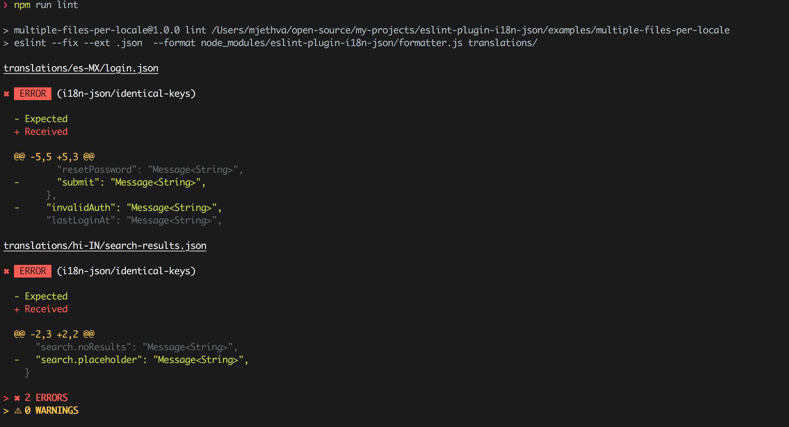
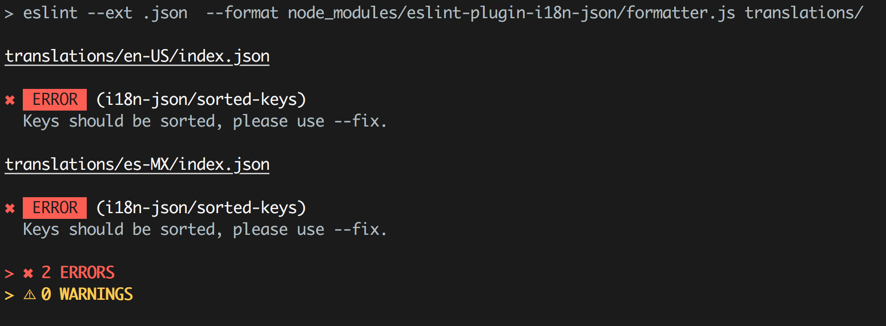

# eslint-plugin-i18n-json

[](https://www.npmjs.com/package/eslint-plugin-i18n-json)
[](https://travis-ci.org/godaddy/eslint-plugin-i18n-json)

> Fully extendable eslint plugin for JSON i18n translation files.

<p align="center">
  
</p>

🎉 [**Check out the introductory blog post!**](https://godaddy.github.io/2018/04/02/introducing-eslint-plugin-i18n-json/)

## Table of Contents

- [Features](#features-)
- [Getting started](#getting-started)
- [Examples](#examples)
- [Configuring your .eslintrc file (ESLint version `< 9.0.0`)](#configuring-your-eslintrc-file-eslint-version--900)
- [EsLint version `>= 9.0.0`](#eslint-version--900)
- [Rules](#rules)
  - [i18n-json/valid-json](#i18n-jsonvalid-json)
  - [i18n-json/valid-message-syntax](#i18n-jsonvalid-message-syntax)
  - [i18n-json/identical-keys](#i18n-jsonidentical-keys)
  - [i18n-json/sorted-keys](#i18n-jsonsorted-keys)
  - [i18n-json/identical-placeholders](#i18n-jsonidentical-placeholders)
- [Settings](#settings)
  - [i18n-json/ignore-keys](#i18n-jsonignore-keys)
- [Special Thanks](#special-thanks-)
- [License](#license-)
- [Changelog](CHANGELOG.md)


## Features 🚀

- lint JSON translation files
  - rule: `i18n-json/valid-json`
  - configure a custom linter in case the default doesn't fit your needs.

- validate syntax per message
  - rule: `i18n-json/valid-message-syntax`
  - default syntax check is for ICU Message Syntax
  - can support any message syntax through custom validators. [Example](examples/custom-message-syntax/)

- ensure translation files have identical keys
  - rule: `i18n-json/identical-keys`
  - supports different custom mappings and on the fly key structure generation

- sort translation keys in ascending order through eslint auto-fix (case-sensitive)
  - rule: `i18n-json/sorted-keys`
  - can support a custom sort function to satisfy different sorting needs

- ensure translation files have identical placeholders
  - rule: `i18n-json/identical-placeholders`

- ability to ignore certain keys. Example: metadata keys, in progress translations, etc.
  - setting: `i18n-json/ignore-keys` [Example](examples/ignore-keys/)

- The plugin supports **any level of nesting** in the translation file. (escapes `.` in key names)

**Note: Check out the [Examples](examples/) folder to see different use cases and project setups.**

### Requires

- eslint >= 4.0.0
- node >= 6.0.0

## Examples
Check out the [Examples](examples/) folder to see different use cases.

 - [Basic Setup](examples/simple)
 - [Custom Message Syntax](examples/custom-message-syntax)
 - [Custom Sorting Function For Keys](examples/custom-sort)
 - [Identical Keys (Simple)](examples/identical-keys-simple)
 - [Ignoring Keys](examples/ignore-keys)
 - [Multiple Files Per Locale](examples/multiple-files-per-locale)
 - [Webpack Development (eslint-loader)](examples/webpack-local-dev)

## Getting Started

Right out of the box you get the following through our recommended ruleset `i18n-json/recommended`:

- i18n-json/valid-json
  - linting of each JSON translation file
  - default severity: error | 2
- i18n-json/valid-message-syntax
  - default ICU Message syntax validation (using `@formatjs/icu-messageformat-parser`)
  - default severity: error | 2
- i18n-json/sorted-keys
  - automatic case-sensitive ascending sort of all keys in the translation file.
  - Does a level order traversal of keys, and supports sorting nested objects

Let's say your translations project directory looks like the following, (project name: simple)

```BASH
> tree simple -I node_modules

simple
├── package.json
├── readme.md
└── translations
    ├── en-US
    │   └── index.json
    └── es-MX
        └── index.json
```

**In this project directory, do the following:**
1) >npm install --save-dev eslint-plugin-i18n-json
2) If you are using eslint `< 9.0.0` Create a `.eslintrc.js` file in the root dir of your project. For this example: `/simple/.eslintrc.js`.
3) paste in the following:
    ```javascript
    module.exports = {
      extends: [
        'plugin:i18n-json/recommended',
      ],
    };
    ```
4) add this npm script to your `package.json` file.

    - **note:**
      - without the `--fix` option, sorting the translation file won't work
      - the default eslint report formatter, `stylish`, doesn't handle lint messages of varying length well. Hence, we have also built a `custom report formatter` well suited for this plugin.
    ```json
    {
      "scripts": {
        "lint": "eslint --fix --ext .json --format node_modules/eslint-plugin-i18n-json/formatter.js translations/"
      }
    }
    ```
    - *Also, the following builtin formatters provided by eslint also work well: `compact`, `unix`, `visualstudio`, `json`.* [Learn more here](https://eslint.org/docs/user-guide/formatters/)
      - Example usage: `eslint --fix --ext .json --format compact translations/`

5) >npm run lint

6) **Profit!** Relax knowing that each change to the translations project will go through strict checks by the eslint plugin.

    *Example where we have invalid ICU message syntax.*

    

## Configuring your .eslintrc file (ESLint version `< 9.0.0`)
- Simply update your `.eslintrc.*` with overrides for the individual rules.
- Eslint severities: 2 = error, 1 = warning, 0 = off
- Example of the module's default rule configuration:
  - see below for more information about how to further configure each rule. (some options may require switching to a `.eslintrc.js` file)

  ```json
  // .eslintrc.json
  {
    "rules": {
        "i18n-json/valid-message-syntax": [2, {
          "syntax": "icu"
        }],
        "i18n-json/valid-json": 2,
        "i18n-json/sorted-keys": [2, {
          "order": "asc",
          "indentSpaces": 2,
        }],
        "i18n-json/identical-keys": 0
    }
  }
  ```

  ```javascript
  // .eslintrc.js
  module.exports = {
    rules: {
      'i18n-json/valid-message-syntax': [2, {
        syntax: 'icu',
      }],
      'i18n-json/valid-json': 2,
      'i18n-json/sorted-keys': [2, {
        order: 'asc',
        indentSpaces: 2,
      }],
      'i18n-json/identical-keys': 0,
    },
  };
  ```
  
## ESLint version `>= 9.0.0`

- ESLint version `>= 9.0.0` uses flat configuration

```javascript
// eslint.config.(m)js
import i18nJsonPlugin from 'eslint-plugin-i18n-json';

export default {
  files: ['**/*.json'],
  plugins: { 'i18n-json': i18nJsonPlugin },
  processor: {
    meta: { name: '.json' },
    ...i18nJsonPlugin.processors['.json'],
  },
  rules: {
    ...i18nJsonPlugin.configs.recommended.rules,
    'i18n-json/valid-message-syntax': 'off',
  },
};

```

## Rules

### i18n-json/valid-json

- linting of each JSON translation file
- builtin linter uses `json-lint`
- default severity: error | 2
- **options**
  - `linter`: String (Optional)
    - Absolute path to a module which exports a JSON linting function.
      - `Function(source: String)`
      - This function will be passed the source of the current file being processed.
      - It **should throw an Error**, just like `JSON.parse`.
        ```javascript
        // .eslintrc.js
        module.exports = {
          rules: {
            'i18n-json/valid-json': [2, {
              linter: path.resolve('path/to/custom-linter.js'),
            }],
          },
        };
        ```
        ```javascript
        // custom-linter.js
        module.exports = (source) => {
          if (isBad(source)) {
            throw new SyntaxError('invalid syntax');
          }
        };
        ```

  Example output for Invalid JSON.

  

### i18n-json/valid-message-syntax

- default ICU Message syntax validation (using `@formatjs/icu-messageformat-parser`)
- default severity: error | 2
- **options**
  - `syntax`: String (Optional). Default value: `icu`.
    - **Can be a built in validator: `icu`, `non-empty-string`.**
      ```javascript
      // .eslintrc.js
      module.exports = {
        rules: {
          'i18n-json/valid-message-syntax': [2, {
            syntax: 'non-empty-string',
          }],
        },
      };
      ```

    - **Can be an absolute path to a module which exports a Syntax Validator Function.**

      - `Function(message: String, key: String)`
      - This function will be invoked with each `message` and its corresponding `key`
      - It **should throw an Error**, just like `JSON.parse` on invalid syntax.
        ```javascript
        // .eslintrc.js
        module.exports = {
          rules: {
            'i18n-json/valid-message-syntax': [2, {
              syntax: path.resolve('path/to/custom-syntax-validator.js'),
            }],
          },
        };
        ```
        ```javascript
        // custom-syntax-validator.js example
        module.exports = (message, key) => {
          // each message should be in all caps.
          if (message !== message.toUpperCase()) {
            throw new SyntaxError('MESSAGE MUST BE IN ALL CAPS!');
          }
        };
        ```
  Output from the [custom-message-syntax](/examples/custom-message-syntax) example where each message must have the word 'PIZZA' prepended to it.

  

### i18n-json/identical-keys

- compare each translation file's key structure with a reference translation file to ensure consistency
- severity: 0 | off , this rule is OFF by default
- Can turn this rule on by specifying options for it through your `.eslintrc.*` file.
- **options**
  - `filePath` : String | Object (Required)

    - **Can be an absolute path to the reference translation file.**
      ```javascript
      // .eslintrc.js
      module.exports = {
        rules: {
          'i18n-json/identical-keys': [2, {
            filePath: path.resolve('path/to/locale/en-US.json'),
          }],
        },
      };
      ```

    - **Can be an Object which contains a Mapping for how to choose a reference translation file. (chosen by suffix match)**
      ```javascript
      // .eslintrc.js
      module.exports = {
        rules: {
          'i18n-json/identical-keys': [2, {
            filePath: {
              'login.json': path.resolve('./translations/en-US/login.json'),
              'search-results.json': path.resolve('./translations/en-US/search-results.json'),
              'todos.json': path.resolve('./translations/en-US/todos.json'),
            },
          }],
        },
      };
      ```
      - values in the path must be the absolute file path to the reference translation file.
      - the plugin will do a **suffix** match on the current file's path to determine which reference translation file to choose.

    - **Can be an absolute path to an exported function which generates the reference key structure on the fly.** The function will be passed the parsed JSON  translations object and absolute path of the current file being processed.

      - `Function(translations: Object, currentFileAbsolutePath: String) : Object`
      ```javascript
      // .eslintrc.js
      module.exports = {
        rules: {
          'i18n-json/identical-keys': [2, {
            filePath: path.resolve('path/to/key-structure-generator.js'),
          }],
        },
      };
      ```
      ```javascript
      // key-structure-generator.js example
      module.exports = (translations, currentFileAbsolutePath) => {
        // identity key structure generator
        return translations;
      };
      ```

  Output from the slightly advanced [identical keys](/examples/multiple-keys-per-locale) example where some keys from the reference translation file (`en-US`) were not found during comparison.

  

### i18n-json/sorted-keys

- automatic case-sensitive ascending sort of all keys in the translation file
- if turned on, the this rule by will sort keys in an ascending order by default.
- default severity: error | 2
- **options**
  - `sortFunctionPath`: String (Optional). Absolute path to a module which exports a custom sort function. The function should return the desired order of translation keys. The rule will do a level order traversal of the translations and call this custom sort at each level of the object, hence supporting nested objects. This option takes precedence over the `order` option.
      - **NOTE**: eslint does additional verification passes on your files after a "fix" is applied (in our case, once the sorted keys are written back to your JSON file). Ensure your sort function won't switch the ordering once the keys are already sorted. For example, if your sort function looks like `Object.keys(translations).reverse()`, then on the initial pass your keys would be sorted correctly, but in the next pass the order of keys would again be reversed. This would lead to a loop where eslint cannot verify the fix is working correctly. Eslint will not apply the intended sorting fixes in this scenarios.
      - `Function(translations: Object) : Array`
      ```javascript
      // .eslintrc.js
      module.exports = {
        rules: {
          'i18n-json/sorted-keys': [2, {
            sortFunctionPath: path.resolve('path/to/custom-sort.js'),
          }],
        },
      };
      ```
      ```javascript
      // custom-sort.js example
      // Ascending sort
      module.exports = (translations) => {
        return Object.keys(translations).sort((keyA, keyB) => {
          if (keyA == keyB) {
            return 0;
          } else if (keyA < keyB) {
            return -1;
          } else {
            return 1;
          }
        })
      };
      ```
  - `order`: String (Optional). Possible values: `asc|desc`. Default value: `asc`. Case-sensitive sort order of translation keys. The rule does a level order traversal of object keys. Supports nested objects. Note: if you supply a custom sort function through `sortFunctionPath`, then this option will be ignored.
  - `indentSpaces` : Number (Optional). Default value: `2`. The number of spaces to indent the emitted sorted translations with. (Will be passed to `JSON.stringify` when generating fixed output).
  In the case `--fix` is not supplied to eslint, and the `i18n-json/sorted-keys` rule is not switched off, it will emit an
  `error` (or `warning`) if it detects an invalid sort order for translation keys.

  

### i18n-json/identical-placeholders

- compare each translation's placeholders with the reference file to ensure consistency
- severity: 0 | off , this rule is OFF by default
- Can turn this rule on by specifying options for it through your `.eslintrc.*` file.
- **options**
  - `filePath` : String (Required)

    - **Can be an absolute path to the reference translation file.**
      ```javascript
      // .eslintrc.js
      module.exports = {
        rules: {
          'i18n-json/identical-placeholders': [2, {
            filePath: path.resolve('path/to/locale/en-US.json'),
          }],
        },
      };
      ```
## Settings

### i18n-json/ignore-keys

- list of key paths (case sensitive) to ignore when checking syntax and doing key structure comparisons. [Example](examples/ignore-keys/)
- this setting is used by the following rules: `i18n-json/identical-keys`, `i18n-json/valid-syntax` and `i18n-json/identical-placeholders`.
- if the key path points to an object, the nested paths are also ignored.
  - e.g. if the key `a` was added to the `ignore-keys` list, then `a.b` will also be ignored.
    ```json
    {
      "a": {
        "b": "translation"
      }
    }
    ```
- example usage: metadata keys with values not corresponding to the syntax specified or work-in-progress translation keys which should not be used in comparisons.

**Example setting configuration:**

  ```javascript
  // .eslintrc.js
  {
    settings: {
      /*
        None of the key paths listed below
        will be checked for valid i18n syntax
        nor be used in the identical-keys rule comparison.
        (if the key path points to an object, the nested paths are also ignored)
      */
      'i18n-json/ignore-keys': [
        'translationMetadata',
        'login.form.inProgressTranslationKey',
        'some-key'
      ],
    },
  }
  ```

## Disclaimer

- **None of the translations in the examples provided reflect actual GoDaddy translations.** They were just created using Google Translate for example's sake 😉.

## Special Thanks 👏

- Jest platform packages

- @formatjs/icu-messageformat-parser

- report formatter ui heavily inspired from: https://github.com/sindresorhus/eslint-formatter-pretty

- ["Translate" icon](https://thenounproject.com/term/translate/1007332) created by Björn Andersson, from [the Noun Project](https://thenounproject.com/). Used with attribution under Creative Commons.

## License 📋

MIT
